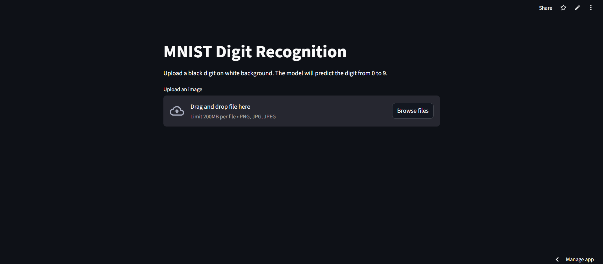

# 🧠 MNIST Digit Recognition (Streamlit + TensorFlow)

A web app that recognizes handwritten digits (0–9) using a Convolutional Neural Network (CNN) trained on the MNIST dataset. Built with TensorFlow and deployed using Streamlit.

## 🚀 Live Demo

🔗 [Click here to try it on Streamlit Cloud](https://fardeen-mnist-digit-recognition.streamlit.app/)

## 📦 Features

- ✅ Recognizes digits from uploaded images
- ✅ Preprocessing to match MNIST format
- ✅ CNN model for high accuracy
- ✅ Built with Streamlit for simple UI
- ✅ Deployable on Streamlit Cloud

## 🧰 Tech Stack

- Python 3.10
- TensorFlow
- NumPy
- Pillow (PIL)
- Streamlit

## 🛠 How It Works

1. **Image Upload** – You upload an image of a digit (28x28 preferred).
2. **Preprocessing** – The image is inverted, resized, and normalized to match the MNIST dataset format.
3. **Prediction** – The trained CNN model predicts the digit.

## 🏗️ Project Structure
mnist-digit-recognition/

│

├── app.py # Streamlit web app

├── mnist_model.h5 # Trained CNN model

├── requirements.txt # Dependencies

├── runtime.txt # Python version

├── README.md # Project documentation

└── assets/ # Screenshots & example images

├── example_digit.png

└── app_screenshot.png

## 🧪 Model Training

The model was trained using a Convolutional Neural Network (CNN) on the MNIST dataset using TensorFlow.

You can view or run the full training notebook here:  
📓 [mnist_train.ipynb](notebooks/mnist_train.ipynb)

### Training Summary:
- Input: 28x28 grayscale images
- Layers: 2 Conv2D + MaxPooling, Flatten, Dense(64), Output(Softmax)
- Epochs: 5
- Accuracy: ~99% train, ~98% test
- Output: `mnist_model.h5` (used in the Streamlit app)

## 📷 Example
Upload an image like this:

## 🖼️ App Preview

## 🧾 Installation (Local)
git clone https://github.com/Fedo-911/-Mnist-Digit-Recognition.git

cd -Mnist-Digit-Recognition

pip install -r requirements.txt

streamlit run app.py

## ☁️ Deployment (Streamlit Cloud)
**1**. Push the repo to GitHub

**2**. Go to https://streamlit.io/cloud

**3**. Click New App

**4**. Select your repo and set app.py as the entry point

**5**. Click Deploy

## 📄 License
MIT License © 2025 FardeenTariq

 

